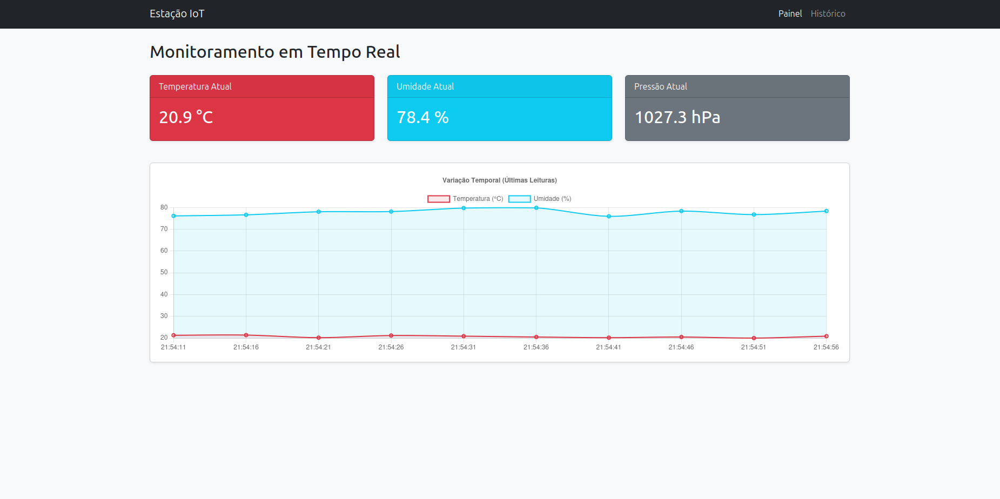
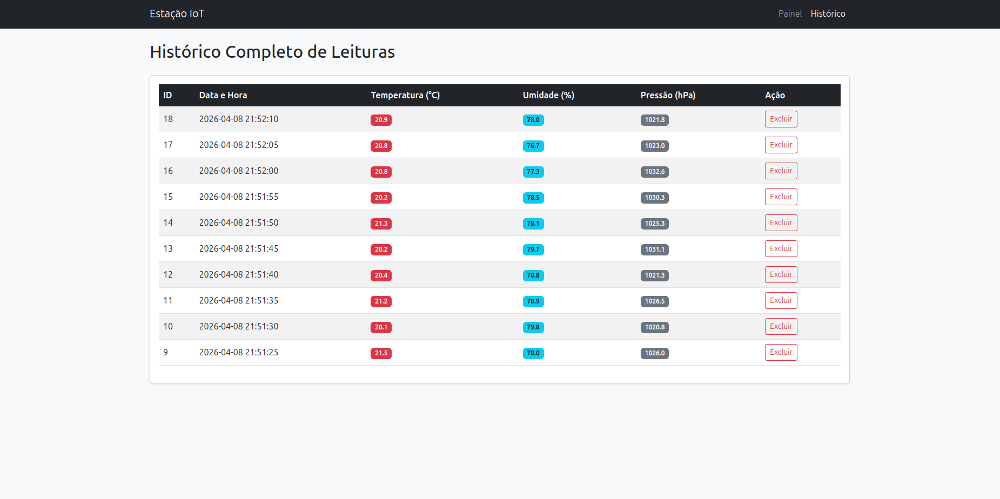
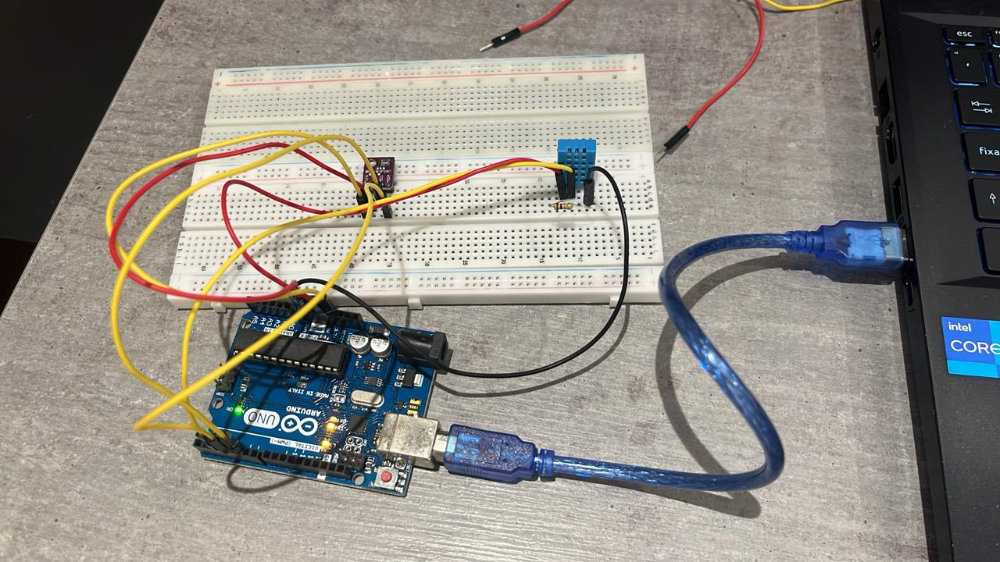

# Estação Meteorológica IoT 

Este projeto é um sistema completo de Internet das Coisas (IoT) para monitoramento meteorológico. Ele lê dados de temperatura e umidade (reais via Arduino ou simulados), envia para uma API REST construída em Python (Flask), armazena em um banco de dados SQLite e exibe os resultados em tempo real através de um painel web interativo.

## Estrutura do Projeto

Abaixo está a organização dos arquivos e diretórios do projeto:

> ```text
> Projeto Murillo/
> ├── requirements.txt         # Lista de dependências do Python
> ├── README.md                # Documentação do projeto
> └── src/                     # Código-fonte principal
>     ├── app.py               # Servidor web e API REST (Flask)
>     ├── config.py            # Configurações do sistema e porta serial
>     ├── database.py          # Funções de interação com o SQLite (CRUD)
>     ├── schema.sql           # Script de criação das tabelas do banco
>     ├── serial_reader.py     # Script que lê dados do Arduino/Simulador
>     └── templates/           # Arquivos de interface Front-end
>         ├── index.html       # Painel com gráficos (Chart.js)
>         └── historico.html   # Tabela com histórico completo
> ```

---

## Pré-requisitos e Dependências

Para rodar este projeto, você precisará ter o **Python 3.8+** instalado.

Primeiro, crie um arquivo chamado `requirements.txt` na raiz do seu projeto e cole o seguinte conteúdo nele:

```text
Flask>=3.0.0
pyserial>=3.5
requests>=2.31.0
```

## Como Instalar e Executar

Siga o passo a passo abaixo para rodar o projeto localmente:

### 1. Preparação do Ambiente
Abra o seu terminal na pasta raiz do projeto e crie/ative um ambiente virtual:

**No Linux / macOS:**
```bash
python -m venv .venv
source .venv/bin/activate
```
**No Windows:**
```bash
python -m venv .venv
.venv\Scripts\activate
```

#### 2. Instalação das Bibliotecas
Com o ambiente ativado (.venv), instale as dependências executando:

```bash
pip install -r requirements.txt
```

#### 3. Configuração do Hardware 

- Faça o upload do código C++ (leitura do sensor DHT) para a placa usando a IDE do Arduino.

- Abra o arquivo src/config.py.

- Altere MODO_SIMULACAO = False.

- Ajuste a PORTA_SERIAL para a porta correta do seu dispositivo (ex: COM3 ou /dev/ttyACM0).

#### 4. Executando o Sistema

O sistema exige que a API (Flask) e o Leitor Serial rodem simultaneamente. Você precisará de dois terminais separados (lembre-se de ativar o ambiente virtual executando source .venv/bin/activate em ambos!).

**Terminal 1 (Iniciando a API e a Interface Web):**
```bash
python src/app.py
```
**Acesse o painel web no navegador através do endereço: http://127.0.0.1:5000**

**Terminal 2 (Iniciando o Leitor/Simulador de Sensores):**

```bash
python src/serial_reader.py
```

Este script ficará rodando em loop, lendo os dados da porta serial (ou gerando simulações) e enviando para a API via método POST a cada 5 segundos.

## Como Estão as Telas?

<p align="center">
<sup>Figura 1: Imagem do Painel do Front-End</sup> <br>
     <br>
</p>

<p align="center">
<sup>Figura 2: Imagem do Histórico do Front-End</sup> <br>
     <br>
</p>

O sistema possui uma interface web amigável e responsiva, dividida em duas telas principais que podem ser acessadas pelo menu de navegação superior (**Painel** e **Histórico**).

### 1. Monitoramento em Tempo Real (Painel Principal)
Esta é a tela inicial do sistema. Seu objetivo é fornecer uma visão rápida e visual das condições meteorológicas atuais do ambiente.

* **Cards de Leitura Atual:** São os três blocos coloridos no topo (Vermelho para **Temperatura**, Azul para **Umidade** e Cinza para **Pressão**).
  * Eles exibem o valor exato da última medição recebida pelo Arduino, atualizando os dados dinamicamente.
* **Gráfico de Variação Temporal:** Um gráfico de linhas interativo que exibe o comportamento da Temperatura e da Umidade ao longo das últimas leituras.
  * O eixo horizontal (X) mostra a hora exata em que o dado foi capturado, e o eixo vertical (Y) mostra os valores numéricos. Serve para identificar rapidamente se o ambiente está esquentando, esfriando ou se a umidade está mudando.

### 2. Histórico Completo de Leituras
Esta tela funciona como um relatório detalhado, exibindo todos os dados que foram salvos no banco de dados da estação meteorológica.

* **Tabela de Dados:** Apresenta os registros de forma organizada em linhas e colunas.
  * **ID:** O número de identificação único daquela leitura no banco de dados.
  * **Data e Hora:** O momento exato em que a leitura foi registrada pelo sistema.
  * **Temperatura, Umidade e Pressão:** Os valores capturados pelos sensores naquele momento específico.
* **Ação (Botão Excluir):** Um botão interativo na última coluna de cada linha que permite ao usuário deletar um registro específico permanentemente do banco de dados (útil para apagar leituras com erro ou limpar dados antigos de teste).

---

## E o Hardware


<p align="center">
<sup>Figura 3: Imagem do Hardware</sup> <br>
     <br>
</p>

O módulo de hardware da Estação Meteorológica é responsável por realizar as medições físicas do ambiente e enviá-las via comunicação Serial (USB) para o servidor local. O circuito foi montado utilizando uma placa controladora e dois sensores ambientais.

### 1. Componentes Utilizados
* **Microcontrolador:** 1x Arduino Uno (Compatível).
* **Sensor de Temperatura e Umidade:** 1x Módulo DHT11 (Versão de 4 pinos).
* **Sensor de Pressão Barométrica:** 1x Módulo BMP280 (Comunicação I2C).
* **Resistor:** 1x Resistor de 10k ohms (Utilizado como *pull-up* para o DHT11).
* **Protoboard:** 1x Placa de ensaio para prototipagem de circuitos.
* **Cabeamento:** Cabos Jumper (Macho-Macho) para conexões.

### 2. Esquema de Ligações (Circuito)

A montagem elétrica foi centralizada na protoboard, utilizando as trilhas laterais de alimentação para distribuir energia de forma uniforme para os dois sensores.

**Alimentação Principal (Arduino -> Protoboard):**
* O pino **3.3V** do Arduino está conectado à trilha positiva vermelha **(+)** da protoboard.
* O pino **GND** do Arduino está conectado à trilha negativa azul **(-)** da protoboard.

**Ligações do Sensor DHT11:**
Olhando o sensor de frente, da esquerda para a direita:
* **Pino 1 (VCC):** Conectado à trilha positiva **(+)** da protoboard.
* **Pino 2 (DATA):** Conectado ao **Pino Digital 2** do Arduino (fio amarelo).
* **Pino 3 (NC):** Não conectado.
* **Pino 4 (GND):** Conectado à trilha negativa **(-)** da protoboard.
* **Circuito Pull-up:** O resistor de **10k ohms** está conectado em paralelo entre o Pino 1 (VCC) e o Pino 2 (DATA) diretamente na protoboard, estabilizando o sinal de leitura.

**Ligações do Sensor BMP280:**
A comunicação deste sensor utiliza o protocolo I2C, requerendo apenas 4 fios:
* **VCC:** Conectado à trilha positiva **(+)** da protoboard (recebendo os 3.3V seguros do Arduino).
* **GND:** Conectado à trilha negativa **(-)** da protoboard.
* **SCL (Clock I2C):** Conectado ao pino analógico **A5** do Arduino (fio amarelo).
* **SDA (Data I2C):** Conectado ao pino analógico **A4** do Arduino (fio amarelo).

### 3. Fluxo de Dados
1. O Arduino Uno fornece energia contínua (3.3V) para os sensores através da protoboard.
2. A cada 5 segundos, o código solicita a leitura digital do DHT11 (via Pino 2) e do BMP280 (via protocolo I2C nos pinos A4/A5).
3. O Arduino agrupa esses três dados (Temperatura, Umidade e Pressão), formata em uma string JSON estruturada (`{"temperatura": 24.50, "umidade": 60.00, "pressao": 1012.30}`) e envia para o computador através da porta Serial (cabo USB).